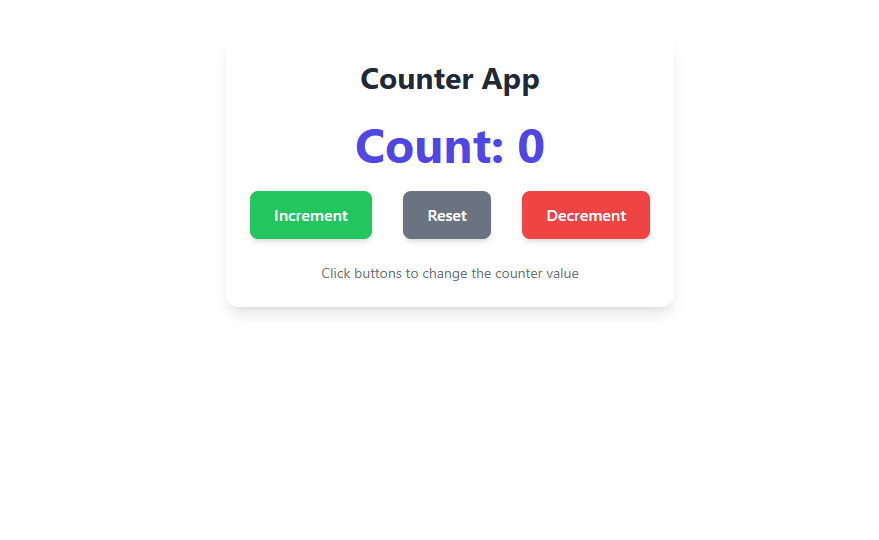

# 🎯 React Counter App with Tailwind CSS



## 🌟 Overview
A sleek, interactive counter application featuring:
- Modern UI built with **React**
- Beautiful styling using **Tailwind CSS**
- Smooth animations and transitions
- Fully responsive design

## ✨ Features
| Feature | Description |
|---------|-------------|
| **🎨 Modern UI** | Clean design with Tailwind CSS styling |
| **🔄 Counter Controls** | Increment, decrement, and reset functionality |
| **🌈 Visual Feedback** | Color-coded buttons with hover/active states |
| **⌨️ Accessibility** | Keyboard-friendly with focus states |
| **📱 Responsive** | Works on all device sizes |

## 🛠️ Tech Stack
<div align="left">
  
| Technology | Version | Purpose |
|------------|---------|---------|
|  React | 18+ | UI Framework |
|  Tailwind CSS | 3+ | Styling |
|  Vite | Latest | Build Tool |

</div>

## 🚀 Quick Start

### Installation
```bash
# Clone repository
git clone https://github.com/alfaashu/counter.git

# Enter project directory
cd counter

# Install dependencies
npm install

# Start development server
npm run dev

🖱️ Usage

Increment → Click the <span style="color:#22c55e">green button</span>
Decrement → Click the <span style="color:#ef4444">red button</span>
Reset → Click the <span style="color:#6b7280">gray button</span>

📂 Project Structure

counter-app/
├── src/
│   ├── App.jsx        # Main component
│   ├── main.jsx       # Entry point
├── public/            # Static assets
├── package.json       # Dependencies
└── README.md          # Documentation

📜 Scripts

Command	Action
npm run dev	Start dev server
npm run build	Create production build
npm run lint	Run linter
npm run preview	Preview production build

💖 Credits

React - UI framework

Tailwind CSS - Styling

⭐ Star this repo if you find it useful!